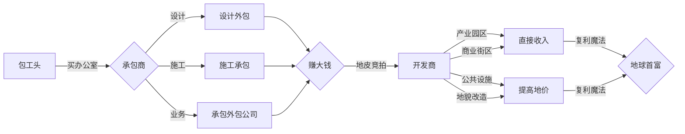

#总说明

##收益目标
售卖价格：29-45CNY  
预计售卖：8000-15000份  
!!! note "为什么要设置收益目标"
    既要竭尽全力做出有趣的游戏，又要让更多的人听我讲故事玩我的游戏，同时还要赚到钱。  
    所以必须做的有趣且商业化。

##市场同类游戏分析
###同类游戏1：房地产大亨
###同类游戏2：开罗游戏诸多作品
###可能同类1：买房记

##基本描述
游戏玩法：模拟经营  
游戏群体：全年龄，适合上班上课摸鱼，可以随时暂停  
游玩时长：总时长9-18h。每天2h不会有断层感，一天2h最舒适  
游玩设备：主要为手机，电脑为次要  
操控方式：键盘和触摸屏  
游戏图形：原计划2D像素，现计划3D，能学习实践shader编写，且更容易卖出去  
流程简述：从包工头成长到地球最大地产开发公司  

##游戏核心
###流程

###流程简述
游戏中玩家操控的主体主要可以分为三个阶段：  
1. 包工头
2. 承包商
3. 开发商

####包工头
没有固定的办公室，纯靠类似微信的表现形式获取新工程。  
可以操控一个玩家本体，有一定的基础数值，并且可以招募施工队员工。通过升级载具，自行车升级摩托，摩托升级面包，面包升级小卡车来提升接收到的工程的质量以及可以招募团队的大小。  
游戏场景是在十字路口旁的摩托车上架着一个承接建筑施工的牌子，主要承接一些家电室内物品维修，室内装修（刮腻子，打灰，铺瓷砖）被招募进大工程团队进入工地的一个小部分之类小工作。  
主要通过累计口碑来提高获取工程的频率。  
寻找工程的主要方式靠等待别人上门（来摩托车这里）。
在购买办公室以及招募足够多需求资质的员工后变为承包商。  
####承包商
有一个固定的工作室，上一个阶段操作的玩家本体退出施工，出现在老板办公位上。  
这个阶段会需要换几次办公室，通过把办公室更换到更加繁华的地区，可以更容易招募到高级人才。并且可以通过购买员工公寓提高员工福利，增加高级人才留下来的几率。  
并且可以在工程中启用外包，可以通过招募特殊职业的员工管理和调取外包团队。  
这个时候将会有三种游戏路线，建筑设计，工程建造，承包外包，或者同时做多种。通过完美完成更多的工程提高公司信誉值来解锁新的公司资质，通过招募更多符合要求职业等级的员工或培训员工升级职业等级来提升至新解锁的公司资质以接取更高级的工程。  
主要能接到的工程分为政府工程和私人工程。政府工程需要通过找关系或者类似的方法增加政府关系值来提高获取几率。政府工程给的钱会更多，会免费提供场地和一些施工材料。私人工程由一些个人或公司发放，给的钱可能不合理，需要玩家自己判断，并且提供的场地和设施完全需要玩家自己判断是否合理是否能接（这里尽量要做的不硬核）。  
政府工程主要有低级：街道住宅翻修，道路养护或建设，水利系统维修或建设，绿化带养护或建设；高级：剧院图书馆等公共设施的设计建造。私人工程主要有低级：城中村民房的设计与施工；中级：别墅；高级：小区写字楼商业区的设计与建设。  
通过提升资质等级和积攒足够的信誉值进入地皮拍卖会，拍下一块地皮变为开发商。  
####开发商
有更大的办公室，可以逐步变为自建的办公楼。  
开发商的主要游戏目标就是通过购买地皮或者获得地皮开发权，然后通过建设使劲提高地皮价格。需要积累的数值是影响力，通过提升影响力，能参加更加高级的地皮拍卖会，能拍到更容易提升价值的地皮（如江边，市区旁，新政治区划的核心等等）从而加速赚钱。  
可以通过上一阶段管理外包的特殊职位管理买卖下属公司或工程团队，通过大量的团队分散建筑工作的工作量。外包团队只能获得部分领导者的领导收益，下属公司或直属团队可以获得全部的领导者收益，但是也需要更多钱维护团队。  
