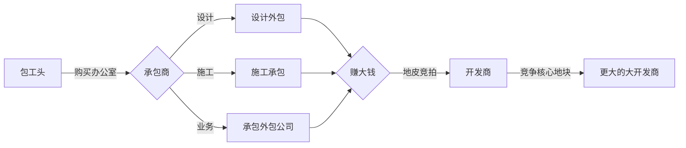

#扩张吧！地球开发商 Earth Developer

##收益目标
售卖价格：29-45CNY  
预计售卖：8000-15000份  
!!! note "为什么要设置收益目标"
    既要竭尽全力做出有趣的游戏，又要让更多的人听我讲故事玩我的游戏，同时还要赚到钱。  
    所以必须做的有趣且商业化。

##市场同类游戏分析
###同类游戏1：房地产大亨
###同类游戏2：开罗游戏诸多作品
###可能同类1：买房记

##基本描述
游戏玩法：模拟经营  
游戏群体：全年龄，适合上班上课摸鱼，可以随时暂停  
游玩时长：总时长10-18h。每天2h不会有断层感，一天2h最舒适  
游玩设备：主要为手机，电脑为次要  
操控方式：键盘和触摸屏  
游戏图形：原计划2D像素，现计划3渲2，能学习实践shader编写，且更容易卖出去  
流程简述：从包工头成长到地球最大地产开发公司  

##游戏核心
###成长图

