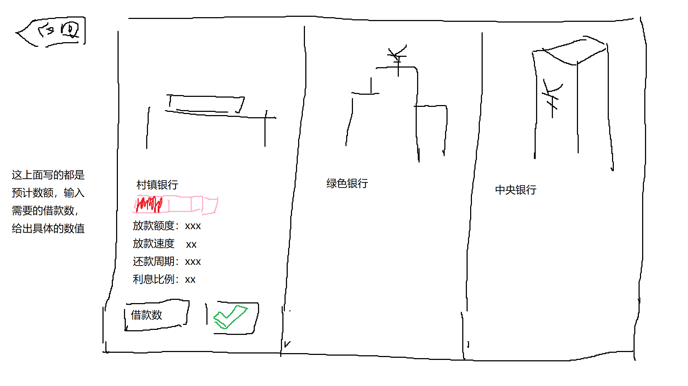

#包工头日记 Contractor's Diary

##基本描述
**游戏类型**：模拟经营  
**玩家群体**：全年龄，可以分段成每日2h不会有断层感，大概6h玩完  
**如何游玩**：使用手机或电脑，如果在手机上，最好能用一只手就能完成操控  
**简述玩法**：扮演包工头或工人，完成一个又一个建筑工程任务  
**后续发展**：可以招募自己的工人，逐步成长为施工队，施工公司设计院，全国最大的房地产开发商  

##游戏核心
**同类游戏**：开罗游戏的诸多模拟经营游戏  
**玩法重点**：在一个工程项目中通过平衡成本风险来获得最大收益，积攒资本。游戏过程中需要制造很多突发事件或固定程序，制造对于“延长积攒资本的时间”的障碍，阻止玩家升级建筑队，或使玩家失败。所以玩家必须经常铤而走险进行一些高风险低成本的施工或者熟练的平衡成本和风险来获得最大的收益。  
**主要乐趣**：扩展自己的公司，发现铤而走险的技巧，平衡风险与成本，发现奇特的玩法  
**防止疲劳**：增加突发事件如政策变动，大宗物资涨跌价，人员工资变动。以及现实中出现的有意思的玩法如贿赂zf，给工人发奖品，公司内团建。主要在提升随机性防止疲劳和增加代入感和设定趣味性，需要防止过于数值化。  

##构成模块

###工程
####工程种类
养护，修缮，建造，设计，总负责
####工程获取
主动承揽：需要消耗一定的游戏时  
客户上门：不需要消耗时间，会弹出提示，不接受的情况下可以保留一段时间  
招标大会：政府招标，私人招标。需要消耗一定时间准备材料和开会。  
####材料
材料种类：沙石，水泥，钢筋，绿植，砖块，装潢材料
材料选择：可以选择建筑材料，有不同的生产厂家，不同的厂家品质也不一样，需要对不同的生产厂家进行甄别。同时可以选择工程需求标准之外的材料，可以选择更高级或更低级。  
材料储存：不可储存
材料需求：材料以“单位”为数量出现，在每个施工段上会标注需求多少单位的特定材料。
####施工
施工方式：可以选择标准施工或者简陋施工中的某一个环节节省成本  
施工时间：包括设计时间，人员施工时间，材料凝结时间。可以通过员工协作培训减少施工时间  
人员上限：根据工程的大小会有不同等级人员的限制（如需要高级以上施工员3，需要高级以下施工员10）
施工段：一个工程会被分为多个阶段（如地基，楼体，绿化，装潢），每个阶段需要的材料种类和施工时间不一样。
加速施工：通过额外支付3倍工资和增加员工压力来加速到2倍施工速度
####成本
材料成本：包括运输费仓储费和材料本身成本。运输费根据采购公司的地点计算，跨国运输费有加关税。  
施工成本：按时间（每日/每月）如器材租赁成本，人员施工人员保险成本，补贴成本（每工程）如危险作业成本，冬夏季极端气候成本，高空作业  
####结款
预付：每个工程会预付0%-50%不等
尾款：平均品质低于要求会降低尾款数，过低会罚款，过高会额外给0%-25%尾款数
尾款支付周期：在完成验收后，不同的公司会有不同的支付周期，大公司的周期通常会久而固定，小公司会比较随机
####验收
在竣工后半个月完成（纯拖时间）

###施工队
####等级与资质
施工队等级：临时施工队，承包施工队，（小/中/大）施工公司，（小/大）设计院，地产开发公司，环球地产开发商
资质：升级为某种类型的施工队需要有特定数量的某种职称的员工
####办公场地
场地：不同的场地有不同的人员容纳上限
特效：在高档办公楼或自建大厦会有额外订单加成
####氛围与协作
氛围：根据工人压力平均（四舍五入），越低越会出现随机增长人工时间，越高越会随即减少
协作值：0-8 在氛围高于1的情况下会增长协作值，每周结算。5时为正常人工施工时间，每增加一点，总人工时间减少5%，减少一点，总人工时间增加10%。（数值得再琢磨）
协作值的增减：0级需要50点协作值升到1级，每级增加一倍。氛围在1以上每提高1积攒速度增加一倍，等于1每周减少25%协作值，等于0每周减少50%
协作值的计算：累计到每个员工的个人属性中，并不是求平均值，**计算公式以后再设计**
内部小队：
专业小组：当人员超过一定数量，可以将相同职业的员工分为一个小组，从而让整个施工队去同时完成多个项目
施工小队：将不同职业的小组组成一个施工队，快捷分配工程（这个功能需要再看，我感觉游戏做不到这么大）
####持有特种机械
全都改为直接花固定的钱
####破产
当钱低于0且不能借贷，将会破产，解散施工队，变回工人

###工人
####工人职业
职业：施工员，设计师，测量员，业务员
职称：0-6 临时工/入门/低/中/高/大师/仙人
转职：还没想好
职称收益：1为标准，工程中每个0级增加5%时间，1级以上每一级每个人减少1%（仙人为-5%），职称越高完成质量越高
####技能点数
基础：体力，学习力
职业：施工，设计，口才
体力：决定工作效率
学习力：决定职业技能点数获取速率
职业技能：根据职业技能的数值，判断职称高低
####精神状态
心情：0-5 跑路，焦虑，紧张，普通，开心，乐
压力：0-5 跑路，压抑，严肃，普通，轻松，愉悦 （显示的时候以5-0的形式显示）
####工资涨跌
基础工资：由职称等级和职位种类决定
####工人管理
聘用：不同职称需要交不同的初次聘用费
解雇：不同职称需要交不同的解雇补偿费，五倍月薪
组织团建：可以选择降低心情的团建如军训，或者减少压力的吃饭度假
节日慰问：可以选择无，也可以选择发钱或者奖励，但是大家可能更喜欢钱
人员培训：花费一定的时间和钱，快速提高人员职业技能点数，会增加压力和降低心情
####自动离职
压力过高或心情过低会自动离职
####外包
当工人不够时，可以选择不同的外包公司进行外包。外包完成的工程质量小于一半取决于公司内的指导外包的员工的技术水平
外包指导为业务员或业务组
####业务员监督员与业务组
业务员：是用来统筹外包事务的职业，其口才决定外包质量的完成度，其他属性决定上限
业务组：必须有一名及以上的业务员，业务员们的总口才决定完成度，业务组的总其他属性决定其上限。

###地皮
这个不准备做

###银行
####不同的银行
村镇银行：放贷速度快，利息高，不允许借大金额
绿色银行：房贷速度极快，利息极高，允许借大金额
中央银行：房贷速度慢，利息中等，允许借超大金额
####借贷
能借到一定的钱，利息符合现实中中国的利息
####银行好感度
0-5级借的次数越多好感越高，利息越低,能借到的钱越多
####提前还款
提前还款需要缴纳0%-5%本金的利息，根据好感度改变，这个行为会降低好感度

###突发事件
####政策变动
自然保护：增加沙石的价格5%-25%，持续5-12个月
绿色保护：增加绿植价格25%-50%，持续9-24个月
水泥禁令：增加水泥价格5%-25%，持续5-12个月
粘土保护：增加砖块价格10%-25%，持续12-36个月
文明城市：绿植免费，持续6个月
税务减免：收入+5%，持续6-12个月
工艺补贴：降低砖块价格50%，持续12-36个月

###天气
夏天：工期略延长，多发夏季补助费  
冬天：在高纬度地区无法开工，低纬度地区减缓材料凝结时间  
#数值总结
总体：金钱，日期
工程：种类，预计完成时间（设计/施工/材料），分段，材料需求，金额，预付比例，限定完成时间，平均质量要求
分段工程：预计完成时间，材料需求，最低质量要求
施工队：人员容纳上限，施工队等级，协作值，氛围
工人：体能，学习力，施工，设计，口才，心情，压力，职称，工资，隐藏协作值

#基础原型

##菜单
工程管理
>当前工程
>发布广告
>招标大会
>上门客户

员工管理
>招聘
>员工
>分组
>任务分配

银行
供应商信息
施工队日志
日历
读取存档
快速保存
保存并退出

##主界面
###公司

###工程

##工程管理
##员工管理
###招聘
####biss直聘

####猎头信息

###员工
###分组

###任务分配

我觉得这三个可以组合成一个，后面再想

##银行

##供应商信息
##施工队日志
##日历